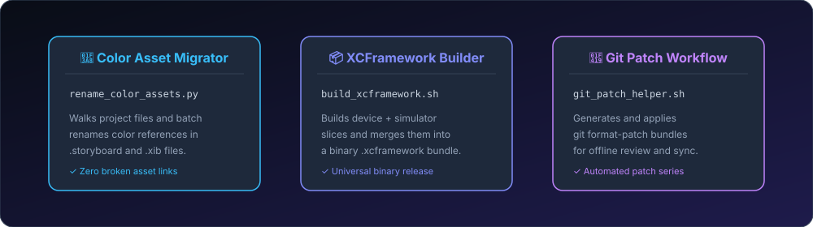

# Xcode Developer Scripts 🛠️

[](https://github.com/nilkanthdesai76/xcode-developer-scripts/actions)
A collection of battle-tested automation scripts and CLI utilities for Apple platforms engineers (iOS, macOS, visionOS).

[](https://developer.apple.com/macos)
[](https://python.org)
[](https://www.gnu.org/software/bash/)
[](LICENSE)

<p align="center">
  
</p>

---

## 📑 Included Scripts

| Script | Language | Description |
| :--- | :--- | :--- |
| **`rename_color_assets.py`** | Python | Batch searches and renames color asset references across `.storyboard` and `.xib` files when assets are renamed. |
| **`build_xcframework.sh`** | Bash | Compiles iOS device and simulator slices and bundles them into a universal binary `.xcframework`. |
| **`git_patch_helper.sh`** | Bash | Automates generating and applying `git format-patch` series for code reviews and offline transfers. |

---

## 🚀 Usage

### 1. Batch Rename Storyboard Color Assets

When you rename a color asset in `Assets.xcassets`, Storyboards and XIBs often break with invalid color references. Run:

```sh
python3 scripts/rename_color_assets.py --old OldBrandColor --new NewBrandColor --dir ./MyApp
```

### 2. Build Universal XCFramework

```sh
chmod +x scripts/build_xcframework.sh
./scripts/build_xcframework.sh MyFramework MyFramework.xcodeproj
```

The compiled `.xcframework` will be generated in `./build/xcframework/MyFramework.xcframework`.

### 3. Git Patch Automation

```sh
chmod +x scripts/git_patch_helper.sh

# Create patches against main branch
./scripts/git_patch_helper.sh create main ./patches

# Create patch for specific commit
./scripts/git_patch_helper.sh commit a1b2c3d ./patches

# Apply patch
./scripts/git_patch_helper.sh apply ./patches/0001-my-feature.patch
```

---

## 📄 License

This project is licensed under the MIT License - see the [LICENSE](LICENSE) file for details.
